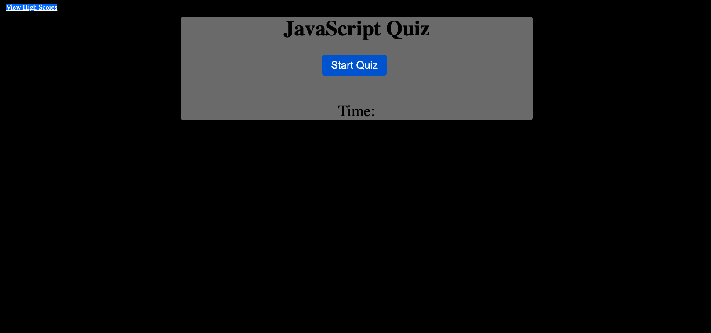
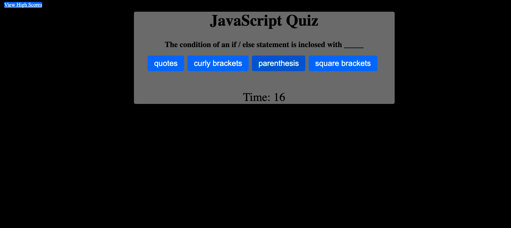
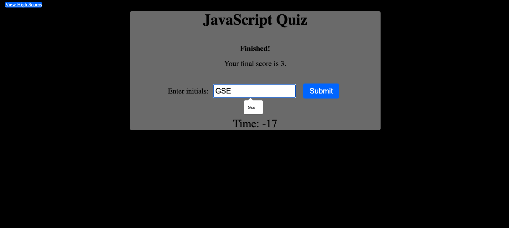

# JavaScipt-fundamentals-quiz

## Description

In this project, I was motivated to showcase my understanding of the vast spectrum of JavaScript. From calling different items in arrays to utilizing local storage, event timers, click events, making forms, and more. I built this project as a challenge to myself to show I can provide a functional, interactive web app utilizing the aformentioned functions on JavaScript, and brush up on some CSS skills I've previously learned as well. I also learned a few new things while building this project. Such as iterating items and appending list items when it comes to arrays and different questions in the quiz.

## Installation

This project requires no installation and is available exclusively through your web browser

## Usage

Upon clicking the 'Start Quiz' button, the user will be taken through a series of multiple choice questions, starting with 30 seconds total, and for each incorrect answer time will be removed from the clock, upon the end of questioning, the user will be asked to submit their initials that will be posted and available to view on the 'View High Scores' link.

## License

The MIT License information can be viewd in the LICENSE file associated with this project.

---

